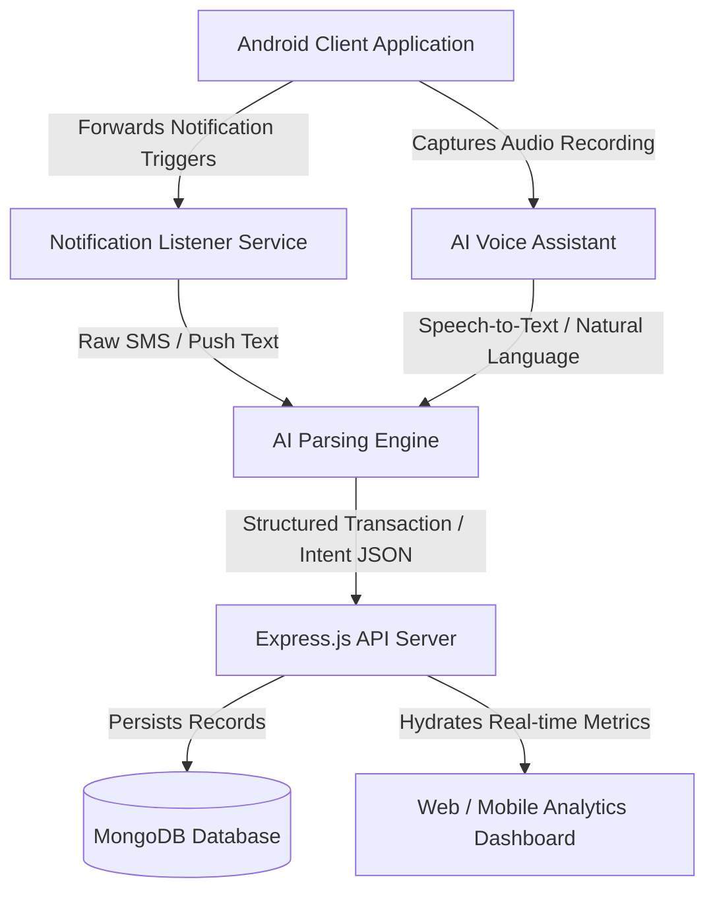

# LifeSync AI
### AI-Powered Personal Finance & Smart Life Management Platform

LifeSync AI is an intelligent personal finance and daily life management platform designed to automate expense tracking, improve financial awareness, and simplify everyday task management using Artificial Intelligence.

Unlike traditional finance tracker applications that depend heavily on manual data entry, LifeSync AI focuses on end-to-end automation through intelligent notification parsing, natural language processing, OCR document scanning, and voice-based interaction.

---

## 🛠️ System Architecture & Data Flow



---

## 🎯 Value Proposition: Problems Solved

| Financial Challenges Solved | Daily Life Challenges Solved |
| :--- | :--- |
| **Overspending without awareness**: Budget limit setups and live alerts trigger when thresholds are reached. | **Missing reminders & appointments**: Real-time push notifications track critical due dates. |
| **Forgetting EMI & bill payments**: Automated triggers remind users of recurring commitments. | **Poor task management**: Integrates daily productivity checks and task checklists. |
| **Poor debt management**: Tracks borrowed and lent accounts in a unified pane. | **Subscription wastage**: Smart insights indicate underutilized subscription models. |
| **Lack of savings planning**: Provides automatic timeline predictions for goals. | **Lack of financial discipline**: Auto-generates a monthly Financial Health Score. |
| **Manual entry fatigue**: Parses notification text to log expenses instantly. | **Difficulty tracking recurring items**: Learns and matches routine spending dates. |

---

## 💡 Core Innovation Highlights

### 1. Automatic UPI Transaction Detection
Instead of requiring users to manually input receipts, LifeSync AI listens to transaction notifications from payment gateways (Google Pay, PhonePe, Paytm, BHIM) and banking applications, translating them into structured DB records in real time.

```
[ UPI Push Notification ]
         │
         ▼
[ Notification Listener Service ]
         │
         ▼
[ Regex / AI Parsing Engine ] ──► Extracts: Merchant & Amount
         │
         ▼
[ Transaction Classifier ]   ──► Predicts: Expense Category (e.g. Food, Fuel)
         │
         ▼
[ Database & Socket Hub ]    ──► Live updates the Analytics Dashboard
```
* **Supported Platforms**: Google Pay, PhonePe, Paytm, BHIM, local banking apps, and digital wallets.
* **Example Extraction**:
  * *Raw Text*: `"Paid ₹250 to Swiggy using UPI"`
  * *Extracted Schema*: `Amount: 250`, `Merchant: Swiggy`, `Category: Food & Dining`, `Source: UPI`.

### 2. Built-in AI Voice Assistant
Allows hands-free financial management by converting spoken commands into database actions without manual screen tapping.
* **Speech-to-Text Integration**: Converts voice input to raw text.
* **Intent Extraction**: Identifies the user's commands using natural language understanding (NLU).
* **Command Examples**:
  * *"Add ₹300 for groceries"* (Records a new transaction)
  * *"Remind me to pay EMI tomorrow"* (Creates a smart reminder)
  * *"Spent ₹150 on petrol"* (Extracts and saves fuel transaction)
  * *"Show my food expenses this month"* (Queries analytics)

---

## 🧩 Unified Modules Specification

### Module 1: Smart Expense Manager
Core budgeting and expense ledger system.
* **Daily Tracker**: Logs all income and expenditures.
* **Categorization**: Auto-groups spending (Food, Fuel, Shopping, Entertainment, EMI, Rent, Recharge, Bills).
* **Budget Limits**: Warns users when approaching set thresholds.

### Module 2: Personal Debt & Lending Manager
Maintains records of personal credit and debit transactions.
* **Lending Log**: Tracks amounts lent to external entities.
* **Borrowing Log**: Tracks loans and repayments.
* **Due Alerts**: Automates alerts for upcoming repayments.
* **Partial Settlement**: Supports logging split payments.

### Module 3: "Can I Afford This?" AI Analyzer
Real-time purchase feasibility analysis.
* **Assessment Engine**: Checks if an upcoming discretionary purchase is financially safe.
* **Inputs Evaluated**: Current monthly income, savings rate, existing debts, EMI burden, fixed monthly expenditures, and upcoming bills.
* **Recommendation Format**: Generates logical feedback (e.g., *"Buying this now may reduce your emergency savings below safe levels. Suggested waiting period: 2 months."*).

### Module 4: AI Daily Life Assistant
Comprehensive daily task scheduler.
* **Trackers**: Registers task checklists, medicine schedules, utility bill dates, flight/travel bookings, and subscription renewals.

### Module 5: Financial Health Score
An algorithm that ranks the user's monthly financial wellness.
* **Metrics Tracked**: Savings rate, debt-to-income ratio, EMI overhead percentage, spending consistency, and payment timeliness.
* **Score Metrics**:
  * **90+**: Excellent
  * **70 - 89**: Good
  * **50 - 69**: Warning
  * **Below 50**: Risky

### Module 6: AI Habit Learning
Analyzes historical spending records to determine user habits.
* **Learns**: Core spending routines, typical utility recharge dates, payment patterns, and anomalies (e.g., *"You usually spend heavily during weekends."*).

### Module 7: Smart Notifications
Intelligent alert dispatcher.
* **Scope**: Broadcasts overspending alerts, EMI warnings, low bank balance warnings, and subscription renewal notifications.

### Module 8: Analytics Dashboard
Consolidated view of financial indicators.
* **Visual Widgets**: Monthly expense breakdown graphs, debt settlement summaries, savings trends, and custom AI improvement suggestions.

### Module 9: Goal Planner
Purpose-driven savings logs.
* **Scope**: Enables goal parameters (e.g., Laptop purchase, Bike savings, Emergency Fund, Vacation).
* **AI Timeframe Forecast**: Auto-calculates durations (e.g., *"You can save ₹1 lakh within 8 months based on your current savings rate."*).

### Module 10: OCR Bill Scanner
Automated receipts scanning pipeline.
* **Extraction**: Uses OCR to scan printed or digital bills.
* **Parameters Detected**: Date of transaction, Merchant name, itemized pricing, tax additions, and final amount.

### Module 11: Smart Subscription Tracker
Recurring digital service audits.
* **Scope**: Audits active subscriptions (Netflix, Spotify, mobile recharges).
* **Dormancy Warning**: Flags underutilized accounts (e.g., *"You rarely use this subscription. Consider cancelling it to save ₹199/month."*).

### Module 12: Emergency Expense Predictor
Predicts potential cash flow deficits.
* **Scope**: Identifies risky spending patterns, forecasts cash shortages, and flags borrowing patterns.

---

## ⚡ Quick Start & Setup

The codebase is organized as a monorepo. Follow the setup directions below to launch the backend, mobile application, and web dashboard.

### 1. Repository Sub-Folders
* **[lifesync-backend](file:///c:/Users/WELCOME/Desktop/LifeSync/LifeSync/lifesync-backend)**: Express.js Server API + Socket.IO + MongoDB models.
* **[lifesync-mobile](file:///c:/Users/WELCOME/Desktop/LifeSync/LifeSync/lifesync-mobile)**: React Native mobile client managed by Expo.
* **[lifesync-web](file:///c:/Users/WELCOME/Desktop/LifeSync/LifeSync/lifesync-web)**: React + Vite responsive web administration console.

### 2. Launching Backend Server
```bash
cd lifesync-backend
npm install
# Copy the environment template and fill in your details:
cp .env.example .env
npm run dev
```
*API documentation is served at `http://localhost:5000/api-docs/`.*

### 3. Launching Mobile Expo Client
```bash
cd lifesync-mobile
npm install
npx expo start
```
*Scan the QR code in the terminal with the Expo Go app on your physical device, or press `a` (Android) / `i` (iOS).*

### 4. Launching Web Dashboard Client
```bash
cd lifesync-web
npm install
npm run dev
```
*Access the local web dashboard instance in your browser at `http://localhost:5173`.*

---

## 📄 License
ISC &copy; 2026 LifeSync AI Team. All rights reserved.
